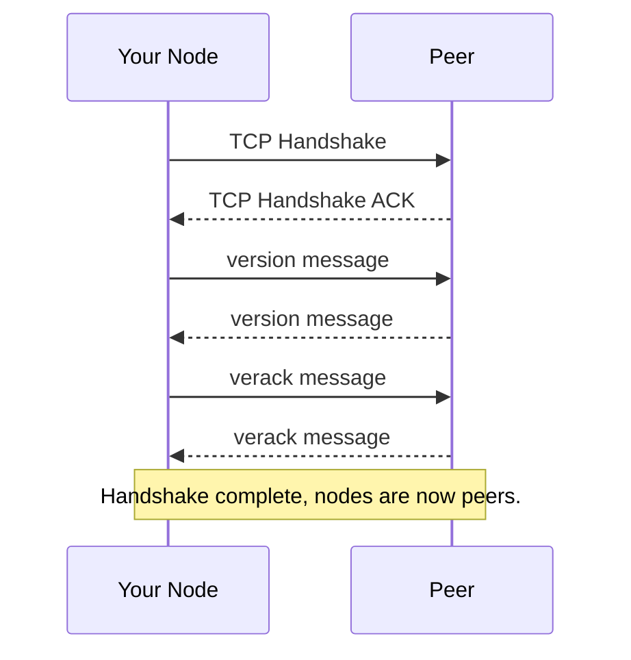
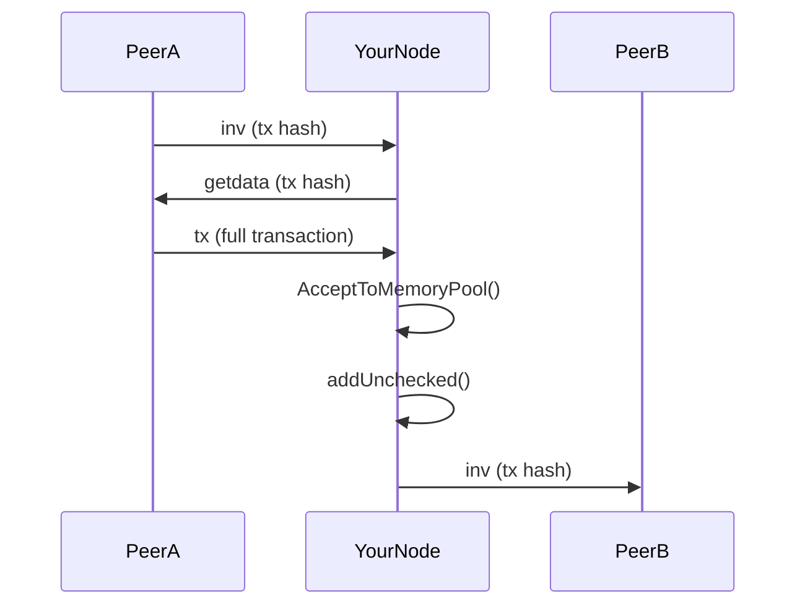
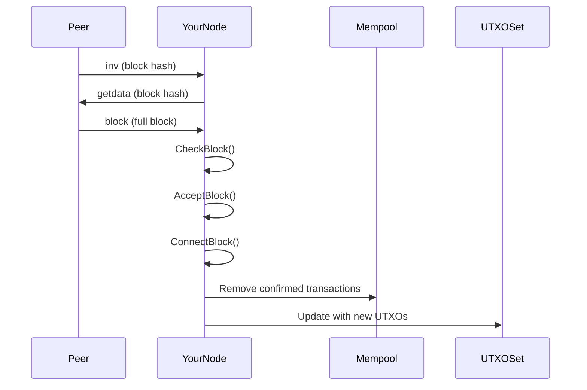
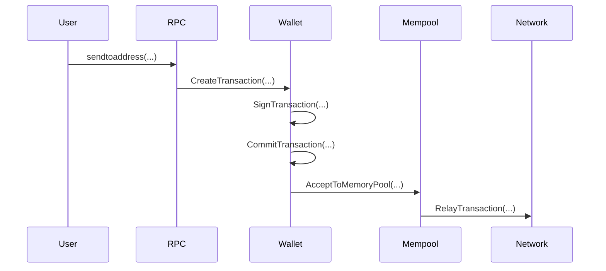
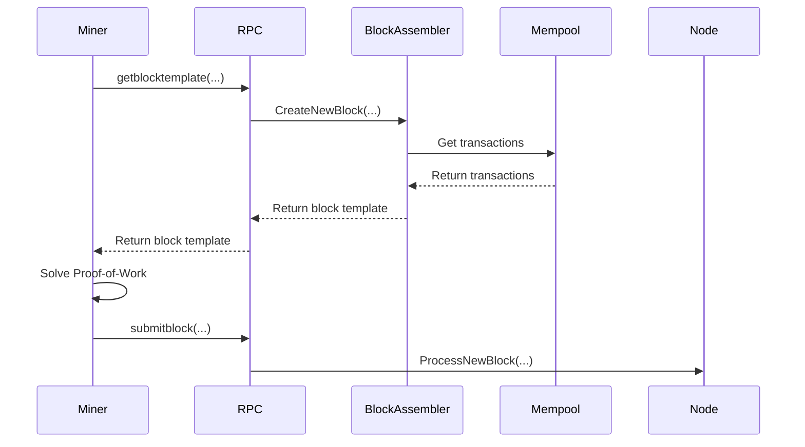

# Bitcoin Core Walkthroughs

This document provides detailed, step-by-step walkthroughs of key runtime flows in Bitcoin Core. Each walkthrough includes references to the specific files, functions, and approximate line numbers involved.

## Table of Contents

1.  [Peer Connection and Handshake](#1-peer-connection-and-handshake)
2.  [Transaction Reception, Validation, and Relay](#2-transaction-reception-validation-and-relay)
3.  [Block Reception, Validation, and Connection](#3-block-reception-validation-and-connection)
4.  [Wallet Creates and Sends a Transaction](#4-wallet-creates-and-sends-a-transaction)
5.  [Mining a New Block](#5-mining-a-new-block)

---

## 1. Peer Connection and Handshake

This walkthrough covers the process of a Bitcoin Core node connecting to a peer and completing the version handshake, which is the first step in establishing a communication channel.

*   **Goal:** Establish a new connection to a peer and exchange `version` messages.
*   **Key Files:** `src/net.cpp`, `src/net_processing.cpp`

### Step-by-Step Execution Trace

1.  **Initiate Connection:**
    *   **File:** `src/net.cpp`
    *   **Function:** `CConnman::OpenNetworkConnection()`
    *   **Description:** The connection manager (`CConnman`) decides to connect to a new peer. It calls `ConnectNode()`, which in turn calls `ConnectSocket()` to establish a TCP connection.

2.  **Socket Thread Start:**
    *   **File:** `src/net.cpp`
    *   **Function:** `CConnman::ThreadSocketHandler()`
    *   **Description:** Once the TCP connection is established, a new thread is spawned to handle communication with the peer. This thread's main loop is `ThreadSocketHandler`.

3.  **Send `version` Message:**
    *   **File:** `src/net.cpp`
    *   **Function:** `CNode::PushVersion()`
    *   **Description:** The node immediately sends a `version` message to the peer to introduce itself. This message contains information like the node's protocol version, services, and current block height. This is typically called from `CConnman::ConnectNode`.

4.  **Receive `version` Message:**
    *   **File:** `src/net_processing.cpp`
    *   **Function:** `ProcessMessage(CNode* pfrom, const std::string& msg_type, CDataStream& vRecv, ...)`
    *   **Description:** The node's `ThreadSocketHandler` receives the peer's `version` message. The message is then passed to `ProcessMessage` where `msg_type` is `"version"`.

5.  **Process `version` Message:**
    *   **File:** `src/net_processing.cpp`
    *   **Function:** `ProcessVersionMessage(CNode* pfrom, ...)` (called within `ProcessMessage`)
    *   **Description:** This function processes the received `version` message. It checks for compatibility, saves the peer's version information, and sends a `verack` message to acknowledge receipt.

6.  **Receive `verack` Message:**
    *   **File:** `src/net_processing.cpp`
    *   **Function:** `ProcessMessage(CNode* pfrom, ...)`
    *   **Description:** The node receives the peer's `verack` message. `ProcessMessage` is called with `msg_type` as `"verack"`.

7.  **Finalize Handshake:**
    *   **File:** `src/net_processing.cpp`
    *   **Function:** `PeerLogicValidation::FinalizeIncomingConnection(CNode* pfrom)` (called within `ProcessMessage` for "verack")
    *   **Description:** The `verack` message signals the completion of the handshake. The peer is now considered fully connected, and the node can start sending other messages like `getaddr` and `getheaders`.

### Mermaid Sequence Diagram

---

## 2. Transaction Reception, Validation, and Relay

This walkthrough covers the process of a Bitcoin Core node receiving a transaction from a peer, validating it, adding it to the mempool, and then relaying it to other peers.

*   **Goal:** Receive, validate, and relay a new transaction.
*   **Key Files:** `src/net_processing.cpp`, `src/validation.cpp`, `src/txmempool.cpp`

### Step-by-Step Execution Trace

1.  **Receive `inv` Message:**
    *   **File:** `src/net_processing.cpp`
    *   **Function:** `ProcessMessage(CNode* pfrom, ...)`
    *   **Description:** The node receives an `inv` message from a peer, announcing a new transaction. The `inv` contains the hash of the transaction.

2.  **Request Transaction:**
    *   **File:** `src/net_processing.cpp`
    *   **Function:** `ProcessGetData(CNode* pfrom, ...)` (called from `ProcessMessage` for "inv")
    *   **Description:** The node requests the full transaction data from the peer by sending a `getdata` message.

3.  **Receive `tx` Message:**
    *   **File:** `src/net_processing.cpp`
    *   **Function:** `ProcessMessage(CNode* pfrom, ...)`
    *   **Description:** The node receives the `tx` message containing the full transaction.

4.  **Validate Transaction:**
    *   **File:** `src/validation.cpp`
    *   **Function:** `AcceptToMemoryPool(CTxMemPool& pool, CValidationState& state, const CTransactionRef& ptx, ...)`
    *   **Description:** The transaction is passed to `AcceptToMemoryPool`, which performs a series of checks, including syntax, inputs, and scripts.

5.  **Add to Mempool:**
    *   **File:** `src/txmempool.cpp`
    *   **Function:** `CTxMemPool::addUnchecked(const CTxMemPoolEntry& entry, ...)`
    *   **Description:** If the transaction is valid, it's added to the mempool.

6.  **Relay Transaction:**
    *   **File:** `src/net_processing.cpp`
    *   **Function:** `RelayTransaction(const uint256& hash)`
    *   **Description:** The node announces the new transaction to its other peers by sending them an `inv` message.

### Mermaid Sequence Diagram

---

## 3. Block Reception, Validation, and Connection

This walkthrough covers the process of a Bitcoin Core node receiving a new block from a peer, validating it, and connecting it to the main chain.

*   **Goal:** Receive, validate, and connect a new block.
*   **Key Files:** `src/net_processing.cpp`, `src/validation.cpp`

### Step-by-Step Execution Trace

1.  **Receive `inv` or `headers` Message:**
    *   **File:** `src/net_processing.cpp`
    *   **Function:** `ProcessMessage(CNode* pfrom, ...)`
    *   **Description:** The node receives an `inv` message with the new block's hash, or a `headers` message with the new block's header.

2.  **Request Block:**
    *   **File:** `src/net_processing.cpp`
    *   **Function:** `ProcessGetData(CNode* pfrom, ...)`
    *   **Description:** The node requests the full block data from the peer by sending a `getdata` message.

3.  **Receive `block` Message:**
    *   **File:** `src/net_processing.cpp`
    *   **Function:** `ProcessMessage(CNode* pfrom, ...)`
    *   **Description:** The node receives the `block` message containing the full block.

4.  **Validate Block:**
    *   **File:** `src/validation.cpp`
    *   **Function:** `CheckBlock(const CBlock& block, CValidationState& state, const Consensus::Params& consensusParams, ...)`
    *   **Description:** The block is passed to `CheckBlock`, which performs a series of stateless checks (e.g., proof-of-work, transaction merkle root).

5.  **Accept Block:**
    *   **File:** `src/validation.cpp`
    *   **Function:** `AcceptBlock(const std::shared_ptr<const CBlock>& pblock, CValidationState& state, CChainParams& chainparams, ...)`
    *   **Description:** If the block is valid, it's added to the block index.

6.  **Connect Block:**
    *   **File:** `src/validation.cpp`
    *   **Function:** `ConnectBlock(const CBlock& block, CValidationState& state, CBlockIndex* pindex, CCoinsViewCache& view, ...)`
    *   **Description:** The block is connected to the main chain. This involves updating the UTXO set and removing the block's transactions from the mempool.

### Mermaid Sequence Diagram

---

## 4. Wallet Creates and Sends a Transaction

This walkthrough covers the process of a user creating a new transaction with the wallet and broadcasting it to the network.

*   **Goal:** Create, sign, and broadcast a new transaction.
*   **Key Files:** `src/wallet/rpcwallet.cpp`, `src/wallet/wallet.cpp`

### Step-by-Step Execution Trace

1.  **User Initiates Transaction:**
    *   **File:** `src/wallet/rpcwallet.cpp`
    *   **Function:** `sendtoaddress(const JSONRPCRequest& request)`
    *   **Description:** A user calls the `sendtoaddress` RPC to create a new transaction.

2.  **Create Transaction:**
    *   **File:** `src/wallet/wallet.cpp`
    *   **Function:** `CWallet::CreateTransaction(const std::vector<CRecipient>& vecSend, ...)`
    *   **Description:** The wallet selects coins, creates the transaction inputs and outputs, and calculates the fee.

3.  **Sign Transaction:**
    *   **File:** `src/script/sign.cpp`
    *   **Function:** `SignSignature(const CKeyStore &keystore, ...)`
    *   **Description:** The wallet retrieves the private keys from the keystore and signs the transaction inputs.

4.  **Commit Transaction:**
    *   **File:** `src/wallet/wallet.cpp`
    *   **Function:** `CWallet::CommitTransaction(CTransactionRef tx, ...)`
    *   **Description:** The signed transaction is added to the wallet's database and submitted to the mempool.

5.  **Submit to Mempool:**
    *   **File:** `src/validation.cpp`
    *   **Function:** `AcceptToMemoryPool(...)`
    *   **Description:** The transaction is validated by the node and added to the mempool.

6.  **Relay Transaction:**
    *   **File:** `src/net_processing.cpp`
    *   **Function:** `RelayTransaction(const uint256& hash)`
    *   **Description:** The node relays the transaction to its peers.

### Mermaid Sequence Diagram

---

## 5. Mining a New Block

This walkthrough covers the process of a miner creating a new block and adding it to the blockchain.

*   **Goal:** Create a new block and solve the proof-of-work puzzle.
*   **Key Files:** `src/rpc/mining.cpp`, `src/miner.cpp`, `src/node/blockassembler.cpp`

### Step-by-Step Execution Trace

1.  **Request Block Template:**
    *   **File:** `src/rpc/mining.cpp`
    *   **Function:** `getblocktemplate(const JSONRPCRequest& request)`
    *   **Description:** A miner calls the `getblocktemplate` RPC to get a new block template.

2.  **Create Block Template:**
    *   **File:** `src/node/blockassembler.cpp`
    *   **Function:** `BlockAssembler::CreateNewBlock(const CScript& scriptPubKeyIn, ...)`
    *   **Description:** The block assembler selects transactions from the mempool and creates a new block template.

3.  **Solve Proof-of-Work:**
    *   **File:** `src/pow.cpp`
    *   **Function:** `CheckProofOfWork(uint256 hash, unsigned int nBits, const Consensus::Params& params)`
    *   **Description:** The miner iterates through nonces until it finds a block hash that meets the current difficulty target. (Note: The actual mining loop is external to Bitcoin Core, but this function is used for verification).

4.  **Submit Block:**
    *   **File:** `src/rpc/mining.cpp`
    *   **Function:** `submitblock(const JSONRPCRequest& request)`
    *   **Description:** The miner submits the solved block to the node.

5.  **Process Block:**
    *   **File:** `src/validation.cpp`
    *   **Function:** `ProcessNewBlock(CChainParams& chainparams, const std::shared_ptr<const CBlock> pblock, ...)`
    *   **Description:** The node receives the new block and processes it in the same way it would process a block from a peer.

### Mermaid Sequence Diagram

