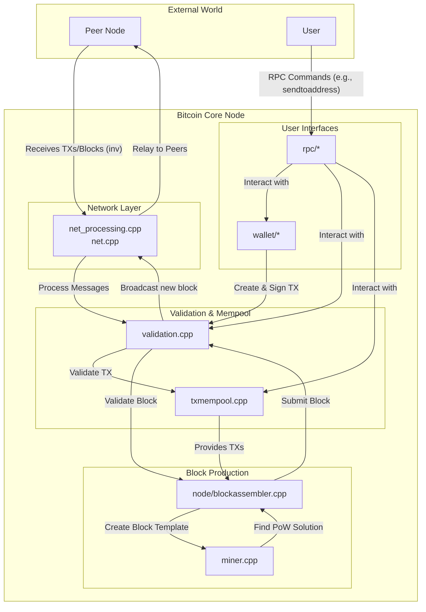

# Bitcoin Core Workflow

This document provides a high-level overview of the primary subsystems within Bitcoin Core and their interactions.

## Subsystem Interaction Diagram

## Component Descriptions

*   **Peer-to-Peer Network (`net_processing.cpp`, `net.cpp`):** Handles all communication with other nodes on the Bitcoin network. This includes discovering new peers, maintaining connections, and relaying transactions and blocks.
*   **Validation Engine (`validation.cpp`):** The heart of consensus enforcement. It validates new blocks and transactions against the full set of Bitcoin's rules (syntax, proof-of-work, script execution, etc.). It maintains the chain state (UTXO set) in `chain.h` and `coins.h`.
*   **Mempool (`txmempool.cpp`):** The transaction memory pool holds unconfirmed transactions that are waiting to be included in a block. It's an in-memory cache that prioritizes transactions based on fees.
*   **Miner (`miner.cpp`, `node/blockassembler.cpp`):** Responsible for creating new blocks. The `BlockAssembler` constructs a block template by selecting transactions from the mempool, and the `Miner` performs the proof-of-work computation.
*   **Wallet (`wallet/*`):** Manages the user's private keys, tracks balances, and creates and signs new transactions.
*   **RPC Interface (`rpc/*`):** Provides a JSON-RPC interface for users and applications to interact with the node (e.g., check balances, send transactions, get block information).
